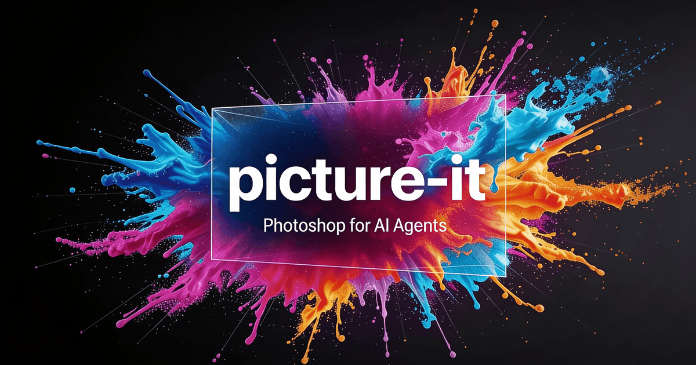

# picture-it



Photoshop for AI agents. Composable image operations from the CLI.

Each command takes an image in, does one thing, and outputs an image. Chain them together to build any visual.

## Setup

```bash
bun install
bun run download-fonts
picture-it auth --fal <your-fal-key>
```

## Commands

### edit — The primary command

Edit any image with a natural language prompt. Uses FAL AI edit models.

```bash
# Change a background
picture-it edit -i photo.jpg --prompt "replace background with modern hotel entrance" -o edited.jpg

# Composite logos into a scene
picture-it edit -i scene.png -i logo.png --prompt "place Figure 2 as a glowing 3D object in the center" -o hero.png

# Multi-image composition
picture-it edit -i bg.png -i logo1.png -i logo2.png \
  --prompt "Place Figure 2 on left and Figure 3 on right in a dramatic VS layout" \
  --model banana-pro -o comparison.png
```

### generate — Create from scratch

```bash
picture-it generate --prompt "dark stage with green spotlight, cinematic" --size 1200x630 -o bg.png
picture-it generate --prompt "abstract gradient mesh" --platform instagram-square -o mesh.png
```

### remove-bg / replace-bg

```bash
picture-it remove-bg -i product.jpg -o cutout.png
picture-it replace-bg -i photo.jpg --prompt "standing in front of a luxury hotel" -o new.jpg
```

### crop

```bash
picture-it crop -i photo.png --size 1080x1080 --position center -o square.png
picture-it crop -i wide.png --size 1200x630 --position attention -o blog.png
```

### grade / grain / vignette

```bash
picture-it grade -i photo.png --name cinematic -o graded.png
picture-it grain -i photo.png --intensity 0.05 -o grained.png
picture-it vignette -i photo.png --opacity 0.4 -o vignetted.png
```

### text — Render text with Satori

```bash
# Simple mode
picture-it text -i bg.png --title "Ship Faster" --font "Space Grotesk" --color white --font-size 72 -o hero.png

# Advanced mode with JSX layout
picture-it text -i bg.png --jsx overlays.json -o hero.png
```

### compose — Overlay compositing

```bash
picture-it compose -i background.png --overlays overlays.json -o result.png
```

### template — No AI, instant output

```bash
picture-it template text-hero --title "Hello World" --subtitle "Built with picture-it" -o hero.png
picture-it template vs-comparison --left-logo a.png --right-logo b.png -o vs.png
picture-it template social-card --title "My Post" --site-name "example.com" -o card.png
picture-it template feature-hero --logo icon.png --title "Feature X" --glow-color "#3b82f6" -o feature.png
```

### pipeline — Multi-step operations

Chain operations in a JSON spec. Each step feeds into the next.

```bash
picture-it pipeline --spec steps.json -o final.png
```

```json
[
  { "op": "generate", "prompt": "dark stage with green spotlight", "size": "1200x630" },
  { "op": "edit", "prompt": "place Figure 1 as a glowing cube in the spotlight", "assets": ["logo.png"] },
  { "op": "crop", "size": "1200x630" },
  { "op": "grade", "name": "cinematic" },
  { "op": "vignette" }
]
```

### batch — Multiple pipelines

```bash
picture-it batch --spec batch.json --output-dir ./images/
```

```json
[
  {
    "id": "hero",
    "pipeline": [
      { "op": "generate", "prompt": "abstract dark background", "size": "1200x630" },
      { "op": "grade", "name": "cinematic" }
    ]
  },
  {
    "id": "card",
    "pipeline": [
      { "op": "generate", "prompt": "gradient mesh", "size": "1200x630" },
      { "op": "text", "title": "My Title", "fontSize": 64 }
    ]
  }
]
```

### info — Analyze an image

```bash
picture-it info -i photo.png
```

Outputs JSON: dimensions, format, transparency, dominant colors, content type guess.

### upscale

```bash
picture-it upscale -i small.png --scale 2 -o large.png
```

## Model routing

The tool automatically picks the cheapest model that can handle the job:

| Operation | Default model | Cost |
|---|---|---|
| `generate` | flux-schnell | $0.003 |
| `edit` (1-10 images) | seedream | $0.04 |
| `edit` (>10 images) | banana2 | $0.08 |
| `edit --model banana-pro` | banana-pro | $0.15 |
| `remove-bg` | birefnet | — |

Override with `--model <name>` on any command.

## Platform presets

Use `--platform <name>` on `generate`, `crop`, or `template`:

| Preset | Size |
|---|---|
| `blog-featured` | 1200x630 |
| `og-image` | 1200x630 |
| `twitter-header` | 1500x500 |
| `instagram-square` | 1080x1080 |
| `instagram-story` | 1080x1920 |
| `youtube-thumbnail` | 1280x720 |
| `linkedin-post` | 1200x627 |

## Output behavior

- **stdout**: only the output file path (or JSON for batch)
- **stderr**: progress logs and warnings
- **Exit 0** on success, **Exit 1** on failure

## Example workflows

### Blog hero with AI background

```bash
picture-it generate --prompt "dark cosmic background with subtle nebula" --size 1200x630 -o bg.png
picture-it edit -i bg.png -i logo.png --prompt "place Figure 2 as a large glowing element in center" --model seedream -o hero.png
picture-it grade -i hero.png --name cinematic -o hero-graded.png
picture-it vignette -i hero-graded.png -o final.png
```

### Instagram photo edit

```bash
picture-it edit -i photo.jpg --prompt "replace background with luxury hotel entrance, keep subject identical" --model banana-pro -o edited.jpg
picture-it crop -i edited.jpg --size 1080x1080 --position center -o square.jpg
```

### Product shot

```bash
picture-it remove-bg -i product.jpg -o cutout.png
picture-it replace-bg -i product.jpg --prompt "clean white studio background with soft shadows" -o studio.png
```

## Dependencies

- **Sharp** — image processing, compositing, post-processing
- **Satori** + **resvg-js** — text rendering (JSX → SVG → PNG)
- **@fal-ai/client** — AI image generation and editing
- **Commander.js** — CLI framework
