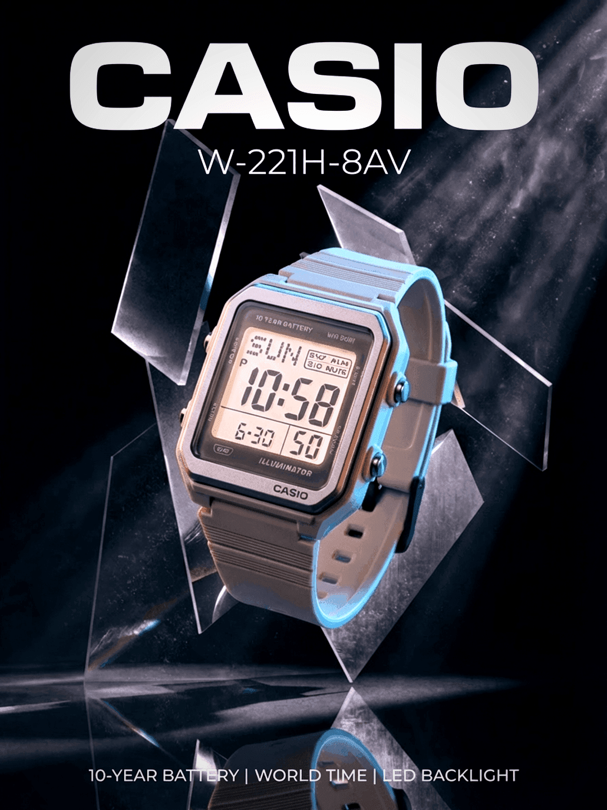

# picture-it


Photoshop for AI agents. Composable image operations from the CLI.

Each command takes an image in, does one thing, and outputs an image. Chain them together to build any visual.

## Samples

|                                                                                                                                                                                             |                                                                                                                                                                              |
| :-----------------------------------------------------------------------------------------------------------------------------------------------------------------------------------------: | :--------------------------------------------------------------------------------------------------------------------------------------------------------------------------: |
|                                                                                                                                          |                                                                                                                           |
|                                                                    **YouTube Thumbnail** — `generate` → `edit` → `crop`                                                                     |                                                     **Product Comparison** — `generate` bg → `remove-bg` × 2 → `compose`                                                     |
|                                      Text behind subject, readable at any size. FAL renders the text as part of the scene so it interacts with depth.                                       | Uses original Apple product images. AI edit models alter product details, so `remove-bg` from a trusted source image and compositing is the reliable path for product blogs. |
|                                                                                                                                                |                                                                                                                                     |
|                                                                    **Magazine Cover** — `generate` → `edit` → `compose`                                                                     |                                                     **Sci-Fi Movie Poster** — `generate` → `edit` → `compose` → `grade`                                                      |
|                              AI-generated portrait with Satori-rendered masthead, headlines, and credits layered on top. Pixel-perfect typography over AI art.                              |                   Multi-pass: Flux generates the scene, SeedDream adds volumetric fog, Satori renders the title and credits. Cinematic grade finishes it.                    |
|                                                                                                                                                |                                                                                                                                     |
|                                                       **Product Social Ad** — `generate` → `edit` → `compose` → `grade` → `vignette`                                                        |                                                     **Watch Poster** — `generate` → `edit` → `edit` → `grade` → `vignette`                                                      |
| 4-pass workflow: Flux Dev generates floating shoe scene, SeedDream places "MACH 7" text behind the shoe for 3D depth, Satori renders product info overlay, then cool-tech grade + vignette. | Only a product image link and spec sheet were provided. Recraft V4 generates the angular glass backdrop, Banana Pro places the watch and renders all text directly into the scene. |

## Install

Requires Node.js 18+.

```bash
npm install -g picture-it
pnpm add -g picture-it
bun install -g picture-it
```

One-off usage:

```bash
bunx picture-it@latest info -i image.png
pnpm dlx picture-it@latest info -i image.png
npx picture-it@latest info -i image.png
```

## Setup

```bash
picture-it download-fonts
picture-it auth --fal <your-fal-key>
```

`download-fonts` is required for text and template commands.

## Local development

```bash
bun install
bun run download-fonts
picture-it auth --fal <your-fal-key>
```

## Commands

### edit — The primary command

Edit any image with a natural language prompt. Uses FAL AI edit models.

```bash
# Change a background
picture-it edit -i photo.jpg --prompt "replace background with modern hotel entrance" -o edited.jpg

# Composite logos into a scene
picture-it edit -i scene.png -i logo.png --prompt "place Figure 2 as a glowing 3D object in the center" -o hero.png

# Multi-image composition
picture-it edit -i bg.png -i logo1.png -i logo2.png \
  --prompt "Place Figure 2 on left and Figure 3 on right in a dramatic VS layout" \
  --model banana-pro -o comparison.png
```

### generate — Create from scratch

```bash
picture-it generate --prompt "dark stage with green spotlight, cinematic" --size 1200x630 -o bg.png
picture-it generate --prompt "abstract gradient mesh" --platform instagram-square -o mesh.png
```

### remove-bg / replace-bg

```bash
picture-it remove-bg -i product.jpg -o cutout.png
picture-it replace-bg -i photo.jpg --prompt "standing in front of a luxury hotel" -o new.jpg
```

### crop

```bash
picture-it crop -i photo.png --size 1080x1080 --position center -o square.png
picture-it crop -i wide.png --size 1200x630 --position attention -o blog.png
```

### grade / grain / vignette

```bash
picture-it grade -i photo.png --name cinematic -o graded.png
picture-it grain -i photo.png --intensity 0.05 -o grained.png
picture-it vignette -i photo.png --opacity 0.4 -o vignetted.png
```

### text — Render text with Satori

```bash
# Simple mode
picture-it text -i bg.png --title "Ship Faster" --font "Space Grotesk" --color white --font-size 72 -o hero.png

# Advanced mode with JSX layout
picture-it text -i bg.png --jsx overlays.json -o hero.png
```

### compose — Overlay compositing

```bash
picture-it compose -i background.png --overlays overlays.json -o result.png
```

### template — No AI, instant output

```bash
picture-it template text-hero --title "Hello World" --subtitle "Built with picture-it" -o hero.png
picture-it template vs-comparison --left-logo a.png --right-logo b.png -o vs.png
picture-it template social-card --title "My Post" --site-name "example.com" -o card.png
picture-it template feature-hero --logo icon.png --title "Feature X" --glow-color "#3b82f6" -o feature.png
```

### pipeline — Multi-step operations

Chain operations in a JSON spec. Each step feeds into the next.

```bash
picture-it pipeline --spec steps.json -o final.png
```

```json
[
  {
    "op": "generate",
    "prompt": "dark stage with green spotlight",
    "size": "1200x630"
  },
  {
    "op": "edit",
    "prompt": "place Figure 1 as a glowing cube in the spotlight",
    "assets": ["logo.png"]
  },
  { "op": "crop", "size": "1200x630" },
  { "op": "grade", "name": "cinematic" },
  { "op": "vignette" }
]
```

### batch — Multiple pipelines

```bash
picture-it batch --spec batch.json --output-dir ./images/
```

```json
[
  {
    "id": "hero",
    "pipeline": [
      {
        "op": "generate",
        "prompt": "abstract dark background",
        "size": "1200x630"
      },
      { "op": "grade", "name": "cinematic" }
    ]
  },
  {
    "id": "card",
    "pipeline": [
      { "op": "generate", "prompt": "gradient mesh", "size": "1200x630" },
      { "op": "text", "title": "My Title", "fontSize": 64 }
    ]
  }
]
```

### info — Analyze an image

```bash
picture-it info -i photo.png
```

Outputs JSON: dimensions, format, transparency, dominant colors, content type guess.

### upscale

```bash
picture-it upscale -i small.png --scale 2 -o large.png
```

## Model routing

The tool automatically picks the cheapest model that can handle the job:

| Operation                 | Default model | Cost   |
| ------------------------- | ------------- | ------ |
| `generate`                | flux-schnell  | $0.003 |
| `edit` (1-10 images)      | seedream      | $0.04  |
| `edit` (>10 images)       | banana2       | $0.08  |
| `edit --model banana-pro` | banana-pro    | $0.15  |
| `remove-bg`               | birefnet      | —      |

Override with `--model <name>` on any command.

## Platform presets

Use `--platform <name>` on `generate`, `crop`, or `template`:

| Preset              | Size      |
| ------------------- | --------- |
| `blog-featured`     | 1200x630  |
| `og-image`          | 1200x630  |
| `twitter-header`    | 1500x500  |
| `instagram-square`  | 1080x1080 |
| `instagram-story`   | 1080x1920 |
| `youtube-thumbnail` | 1280x720  |
| `linkedin-post`     | 1200x627  |

## Output behavior

- **stdout**: only the output file path (or JSON for batch)
- **stderr**: progress logs and warnings
- **Exit 0** on success, **Exit 1** on failure

## Example workflows

### Blog hero with AI background

```bash
picture-it generate --prompt "dark cosmic background with subtle nebula" --size 1200x630 -o bg.png
picture-it edit -i bg.png -i logo.png --prompt "place Figure 2 as a large glowing element in center" --model seedream -o hero.png
picture-it grade -i hero.png --name cinematic -o hero-graded.png
picture-it vignette -i hero-graded.png -o final.png
```

### Instagram photo edit

```bash
picture-it edit -i photo.jpg --prompt "replace background with luxury hotel entrance, keep subject identical" --model banana-pro -o edited.jpg
picture-it crop -i edited.jpg --size 1080x1080 --position center -o square.jpg
```

### Product shot

```bash
picture-it remove-bg -i product.jpg -o cutout.png
picture-it replace-bg -i product.jpg --prompt "clean white studio background with soft shadows" -o studio.png
```

## Dependencies

- **Sharp** — image processing, compositing, post-processing
- **Satori** + **resvg-js** — text rendering (JSX → SVG → PNG)
- **@fal-ai/client** — AI image generation and editing
- **Commander.js** — CLI framework

## Claude, Openclaw, Hermes Skill

picture-it includes a Claude skill so AI agents know how to use it effectively — which models to pick, how to chain operations, composition techniques, and gotchas.

### Install the skill

**Global install** (available in all projects):

```bash
npx skills add geongeorge/picture-it -g
```

**Project install** (available in current project only):

```bash
npx skills add geongeorge/picture-it
```

Browse and review on [clawhub.ai](https://clawhub.ai/geongeorge/picture-it) | [skills.sh](https://skills.sh)

You can also install manually:

```bash
cp -r skill/picture-it ~/.claude/skills/picture-it
```

The skill teaches agents:

- Which commands to use and when
- Model selection (cheapest model that handles the job)
- Multi-pass editing workflows (generate → edit → grade → crop)
- Text-behind-subject technique for thumbnails and posters
- Product photography with `remove-bg` + `compose` (preserves originals)
- Background removal model selection (bria for best edges)
- Common gotchas (rectangular glow artifacts, product detail alteration, etc.)
- How to write effective FAL prompts
- Overlay composition with JSON

The skill includes a `references/composition-guide.md` that agents load on demand for detailed techniques.

## Build and Publish

Bun is required for development (building from TypeScript). The published package runs on plain Node.js.

```bash
# Build (compiles TS → JS, replaces shebang with #!/usr/bin/env node)
bun run build

# Test the build
node dist/index.js --version

# Dry run
npm publish --dry-run

# Publish
npm publish --access public
```

The `prepublishOnly` script runs the build automatically before publishing.

## How Each Sample Was Created

All the images were really generated by my claude code with this skill. I only gave an idea on what I want. However for your reference I have asked it to write here how it did it.

- For the iPhone images I gave links to the apple website images of pro and air
- For the Hoka shoe, I gave claude code the shoe product link
- Everything elser is generated

### Magazine Cover — $0.07


```bash
# 1. Generate editorial sports portrait ($0.03)
picture-it generate \
  --prompt "Dramatic sports magazine cover photography. A female basketball player mid-jump shot, explosive action pose, wearing a sleek dark jersey, sweat glistening. Shot from low angle looking up making her look powerful. Intense facial expression of determination. Background is a basketball arena with dramatic orange and teal stadium lights creating lens flares and bokeh. Motion blur on the background, player is tack sharp. Dust particles visible in the stadium lights. Shot on Canon R5 70-200mm f2.8, sports photography, high speed flash freezing the action. Vertical portrait orientation, space at top and bottom for text" \
  --model flux-dev --size 1080x1440 -o portrait.png

# 2. Add title BEHIND the subject ($0.04)
picture-it edit -i portrait.png \
  --prompt "Add the word 'CLUTCH' in very large bold white block capital letters behind the basketball player. The text should be BEHIND her — her head, shoulders and arm overlap and partially cover the letters, proving the text is behind her body. The text spans the full width of the image, very large, filling the upper portion. Bold condensed sans-serif font, solid white. Keep the player, basketball, arena, lighting exactly the same." \
  --model seedream -o titled.png

# 3. Add coverlines, badges, credits with Satori (free)
picture-it compose -i titled.png --overlays magazine-overlays.json --size 1080x1440 -o cover.png
```

The overlay JSON includes: bottom gradient fade, red "EXCLUSIVE" badge, "UNSTOPPABLE" headline, description text, "PLAYOFF PREVIEW" sidebar with coverlines, and issue date/price.

---

### Sci-Fi Movie Poster — $0.11


```bash
# 1. Generate Nolan-style sci-fi scene ($0.03)
picture-it generate \
  --prompt "Epic Christopher Nolan style science fiction scene. A lone astronaut standing on the surface of a barren alien planet, looking up at an enormous black hole in the sky — a massive swirling accretion disk of blazing orange and white light bending spacetime. The black hole dominates the upper half of the frame, warping the stars around it with gravitational lensing. The planet surface is desolate cracked grey terrain with thin alien atmosphere. In the far distance, a colossal alien monolith structure rises from the surface, perfectly geometric, impossibly tall. The astronaut is small against the cosmic scale. Dust blowing across the surface. Color palette: deep blacks, burning orange accretion disk, cold blue starlight, grey alien terrain. Shot like IMAX 70mm film, extreme wide angle. Vertical composition with space at bottom for title" \
  --model flux-dev --size 1080x1620 -o scene.png

# 2. Add volumetric fog ($0.04)
picture-it edit -i scene.png \
  --prompt "Add thick volumetric fog and mist rolling across the ground at the bottom third of the scene. The fog catches the blue light from the portal above and the warm orange light from the sunset, creating beautiful color mixing in the mist. The astronaut's legs are partially obscured by the fog. Ancient ruins peek through the mist. Keep everything else exactly the same." \
  --model seedream -o foggy.png

# 3. Add title BEHIND astronaut ($0.04)
picture-it edit -i foggy.png \
  --prompt "Add the movie title 'THRESHOLD' in very large bold futuristic sci-fi capital letters positioned in the lower third of the image, BEHIND the astronaut — the astronaut's body overlaps and partially covers some letters. The font should be wide, thin, futuristic — like Interstellar or Arrival movie titles. Clean white letters with subtle glow from the black hole's orange light hitting the edges of the text. The text spans nearly the full width. Keep everything else exactly the same." \
  --model seedream -o titled.png

# 4. Add tagline and credits with Satori (free)
picture-it compose -i titled.png --overlays poster-credits.json --size 1080x1620 -o composed.png

# 5. Post-process (free)
picture-it grade -i composed.png --name cinematic -o graded.png
picture-it vignette -i graded.png --opacity 0.3 -o movie-poster.png
```

The overlay JSON includes: bottom gradient, "BEYOND THE EVENT HORIZON" tagline, divider line, "CHRISTMAS 2026 · IN IMAX 70MM", and full credits block.

---

### YouTube Thumbnail — $0.07


```bash
# 1. Generate runner photo ($0.03)
picture-it generate \
  --prompt "Professional sports photography of a male runner in mid-stride, side profile facing right, running on a mountain trail at golden hour. Athletic build, wearing dark running shorts and a fitted navy shirt. Full body visible, powerful stride with one foot off the ground. Background is a blurred mountain landscape with warm golden sunset light from behind creating rim lighting on the runner. Shallow depth of field, background has motion blur suggesting speed. Shot on Sony A7III 85mm f1.8, photojournalistic sports photography style. Clean composition with space on both sides of the runner for text placement. Photorealistic, high contrast" \
  --model flux-dev --size 1280x720 -o runner.png

# 2. Add text BEHIND the runner ($0.04)
picture-it edit -i runner.png \
  --prompt "Add large bold text to this photo. The word 'RUN' in massive bold black block letters on the LEFT side of the image, BEHIND the runner — the runner's body overlaps and partially covers the text, proving the text is behind him. The word 'FASTER' in the same massive bold black block letters on the RIGHT side, also BEHIND the runner. The text should look like it's painted on the mountain/sky background, with the runner in front of it. The letters should be very large, filling most of the vertical space. Bold condensed sans-serif font, solid black with slight texture. Keep the runner, lighting, and scene exactly the same." \
  --model seedream -o thumbnail.png

# 3. Crop to exact YouTube size (free)
picture-it crop -i thumbnail.png --size 1280x720 --position center -o youtube-thumbnail.png
```

Key technique: **text-behind-subject** — FAL renders the text as part of the 3D scene so the runner occludes it, creating depth. Readable at phone-sized thumbnails.

---

### Product Comparison (iPhone Air vs Pro) — ~$0.01


```bash
# 1. Generate split-tone background ($0.003)
picture-it generate \
  --prompt "Premium product photography background, smooth dark gradient transitioning from deep navy blue on the left to warm dark amber orange on the right, subtle glossy reflective surface at the bottom, no objects, clean minimal, Apple keynote product reveal aesthetic" \
  --size 1200x630 -o bg.png

# 2. Remove backgrounds from original Apple product images (bria)
picture-it remove-bg -i iphair.png --model bria -o air-cutout.png
picture-it remove-bg -i iphpro.png --model bria -o pro-cutout.png

# 3. Compose cutouts + text onto background (free)
picture-it compose -i bg.png --overlays iphone-overlays.json --size 1200x630 -o iphone-comparison.png
```

Why `remove-bg` + `compose` instead of `edit`? AI edit models (seedream, banana) alter product details — camera bumps get modified, logos change, colors shift. For product blogs where accuracy matters, removing the background from a trusted source image and compositing preserves the original pixel-perfectly. The only AI involved is the background removal.

Always use `--model bria` for `remove-bg` — it produces the cleanest edges. The default birefnet leaves rectangular alpha boundaries that cause artifacts with glow/shadow effects.

The overlay JSON positions both trimmed phone cutouts (Air at 23%, Pro at 77%), plus Satori text with "iPHONE" label and "Air vs Pro" in DM Serif Display.

---

### Product Social Ad (Hoka Mach 7) — $0.10


```bash
# 1. Generate floating shoe scene ($0.03)
picture-it generate \
  --prompt "Floating black and white running shoe against a dark background with dramatic studio lighting and motion particles" \
  --model flux-dev --size 1200x630 -o shoe.png

# 2. Add text BEHIND the shoe ($0.04)
picture-it edit -i shoe.png \
  --prompt "Add 'MACH 7' as large bold text behind the shoe so the shoe overlaps it, creating a 3D depth illusion" \
  --model seedream -o with-text.png

# 3. Add product info overlay with Satori (free)
picture-it compose -i with-text.png --overlays hoka-overlays.json -o composed.png

# 4. Post-process (free)
picture-it grade -i composed.png --name cool-tech -o graded.png
picture-it vignette -i graded.png -o hoka-mach7-social.png
```

4-pass workflow: Flux Dev generates the shoe scene, SeedDream places "MACH 7" behind the shoe for 3D depth, Satori renders the product info overlay (gradient fade, "HOKA / Mach 7 / Speed Redefined · 8.3 oz · 5mm Drop" on left, "$145" on right), then `cool-tech` grade for the blue-shifted premium look + vignette.

---

### Casio Watch Poster — $0.55


All that was provided was a [product image link](https://www.casio.com/content/dam/casio/product-info/locales/in/en/timepiece/product/watch/W/W2/w22/w-221h-8av/assets/W-221H-8AV.png.transform/main-visual-pc/image.png) and the product info from Casio's website (model name, description, features). Claude planned the entire composition, chose models, wrote prompts, and chained operations.

```bash
# 1. Generate dramatic angular backdrop with premium model ($0.25)
picture-it generate \
  --prompt "Ultra premium dark product photography backdrop. Pitch black background with sharp angular geometric shapes made of frosted glass and brushed steel floating at dynamic angles. Subtle cold blue and warm amber accent lights hitting the edges of the geometric shapes, creating beautiful light streaks and reflections. A sleek reflective dark surface at the bottom with mirror-like reflections. Volumetric light beams cutting through from upper right. Dust particles visible in the light. Minimal, high-end watch advertisement aesthetic. Shot like a luxury brand campaign, Hasselblad medium format, ultra sharp." \
  --model recraft-v4 --size 1080x1440 -o bg.png

# 2. Place watch into scene with best realism ($0.15)
picture-it edit -i bg.png -i casio-watch.png \
  --prompt "Place Figure 2 (a Casio digital watch) as the central hero of this dark scene. The watch is floating prominently in the center, angled dynamically at about 15 degrees, large and commanding. Dramatic cold blue and warm amber rim lighting wraps around the watch edges. The watch face LCD screen glows softly. Beautiful reflections on the dark surface below. The geometric glass shapes frame the watch naturally. Keep the watch design, LCD display, buttons, strap, and CASIO branding exactly faithful to the original. Professional luxury watch advertisement photography." \
  --model banana-pro -o hero.png

# 3. Crop to exact poster size (free)
picture-it crop -i hero.png --size 1080x1440 --position attention -o cropped.png

# 4. Render all text directly into the image ($0.15)
picture-it edit -i cropped.png \
  --prompt "Add text to this watch advertisement poster. At the top, add 'CASIO' in very large bold white capital letters, wide letter-spacing, clean modern sans-serif font, centered. Below it in smaller thin white letters add 'W-221H-8AV'. At the bottom, add '10-YEAR BATTERY | WORLD TIME | LED BACKLIGHT' in small white capital letters. The text should look naturally lit by the volumetric light beams. Keep everything else exactly the same." \
  --model banana-pro -o with-text.png

# 5. Post-process (free)
picture-it grade -i with-text.png --name cinematic -o graded.png
picture-it vignette -i graded.png --opacity 0.25 -o vignetted.png
picture-it grain -i vignetted.png --intensity 0.02 -o casio-watch-poster.png
```

Key decisions: **Recraft V4** ($0.25) was chosen for the backdrop because it produces the best lighting, materials, and composition — the frosted glass prisms are noticeably more photorealistic than cheaper models. **Banana Pro** ($0.15) was used twice: once for placing the watch with faithful product detail preservation, and again for rendering all text directly into the scene (no Satori overlay — the text is part of the image with natural lighting interaction).

---

### Total Cost for All Samples: ~$0.88

| Sample            | Models Used                      | Cost   |
| ----------------- | -------------------------------- | ------ |
| Magazine Cover    | flux-dev + seedream + Satori     | $0.07  |
| Movie Poster      | flux-dev + seedream × 2 + Satori | $0.11  |
| YouTube Thumbnail | flux-dev + seedream              | $0.07  |
| iPhone Comparison | flux-schnell + bria × 2 + Satori | ~$0.01 |
| Hoka Mach 7       | flux-dev + seedream + Satori     | $0.07  |
